# **Ai Kit UI Instructions**

#### **start method**

path

```python
python3 <path>/main.py
```

After the startup is successful, as shown in the figure below:<br>

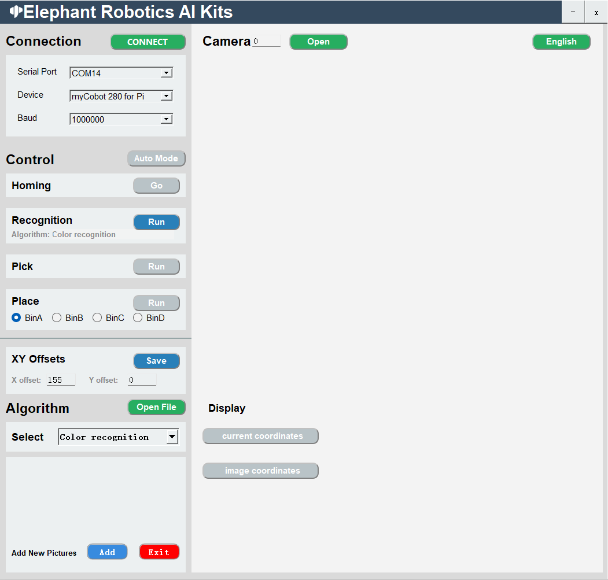 

#### **Features**

##### **language switch**

Click the button in the upper right corner of the window to switch between languages (Chinese, English).<br>
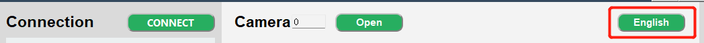

##### **device connection**

1. Select serial port, device, baud rate<br>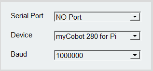
2. Click the 'CONNECT' button to connect, after the connection is successful, the 'CONNECT' button will change to 'DISCONNECT'<br>
   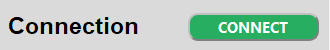

3. Clicking the 'DISCONNECT' button will disconnect the robot arm<br>
   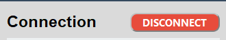

4. After the robotic arm is successfully connected, the gray button will be lit and become clickable.<br>
   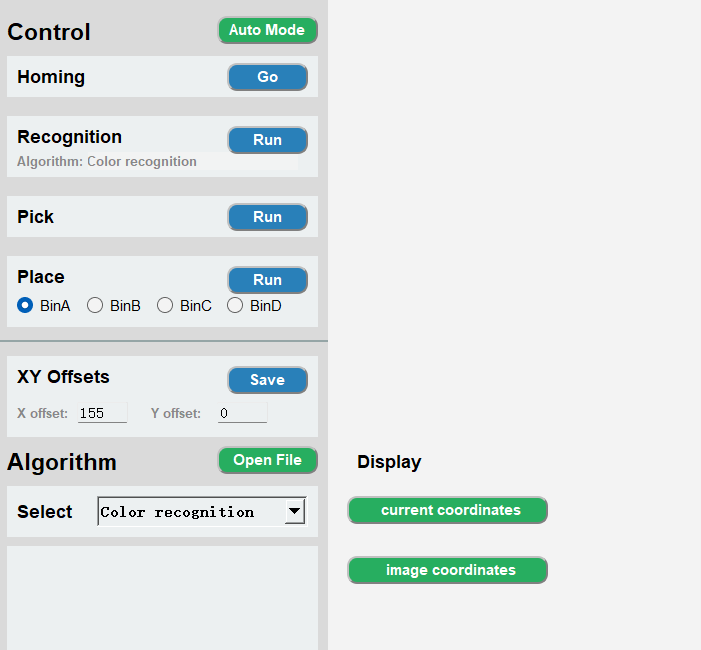

##### **Turn on the camera**

1. Set the camera serial number, the default serial number is 0, when Windows is used, the serial number is usually 1, and when Linux is used, the serial number is usually 0.<br>
   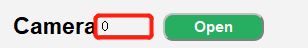

2. Click the 'Open' button to try to open the camera. If the opening fails, you should try to change the camera serial number; the camera is successfully opened as shown in the figure below: Note: Before use, the camera should be adjusted to be just above the QR code whiteboard, and there is a line The straight line is facing the mechanical arm.<br>
   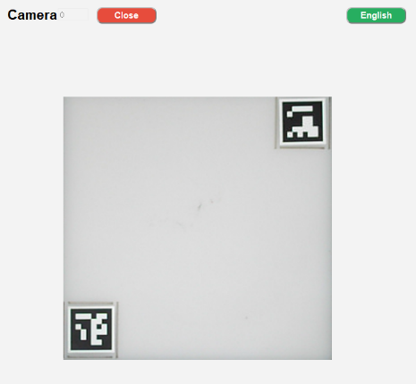

3. After successfully opening the camera, click the 'Close' button to close the camera<br>
   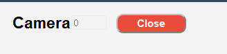

##### **algorithm control**

1. Fully automatic mode, after clicking the 'Auto Mode' button, the recognition, grabbing, and placing will always be on; click the 'Auto Mode' button again to turn off the fully automatic mode.<br>
   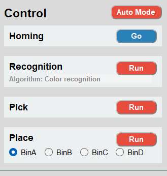

2. Go back to the initial point of grabbing, click the 'Go' button, it will stop the current operation and return to the initial point.<br>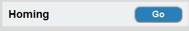

3. Step-by-step 
   Recognition recognition: click the 'Run' button to start the recognition, Aigorithm is the current algorithm used. <br>
   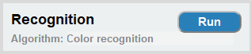
   Pick: Click the 'Run' button to start the capture. After the capture is successful, the recognition and capture will be automatically closed, and you need to click it again for the next use. <br>
   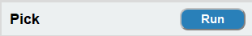
   Placement: Click the 'Run' button to start placing. The BinA, BinB, BinC, and BinD selection boxes correspond to BinA, BinB, BinC, and BinD 4 storage boxes, respectively, and will be placed in the designated storage box after selection.<br>
   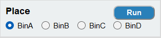

4. Grabbing point adjustment, X offset and Y offset respectively represent the X-axis and Y-axis positions of the mechanical arm coordinates, which can be modified according to actual needs. Click the 'Save' button to save. After saving successfully, it will follow the latest point position to  fetch.<br>
   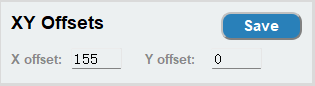<br>
   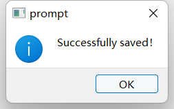

5. Open the file location, our code is open source, you can modify it according to your needs, click the 'Open File' button to open the file location.<br>
    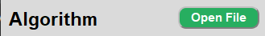
   Open the 'main.py' file and modify it <br>
   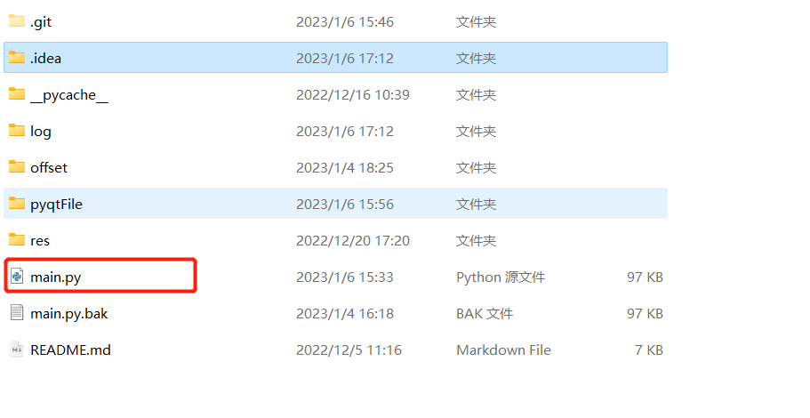
   Note: The 'main.py.bak' file is the backup of the 'main.py' file, delete the 'main.py' file when you need to use it, and re-modify the 'main.py. The suffix of the bak' file is 'main.py'; then re-backup the 'main.py' file and name it 'main.py.bak'; you can also choose to re-download the project.
   
6. Algorithm selection includes color recognition, shape recognition, two-dimensional code recognition, and Keypoints recognition. Selecting the corresponding algorithm will perform corresponding recognition.<br>
   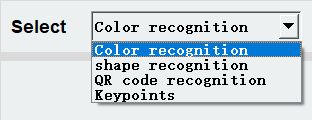

6. How to use yolov5.
    After successfully connecting the robotic arm, the algorithm selects 'yolov5'<br>
   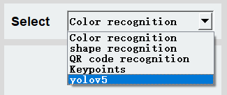
   then turn on the camera<br>
   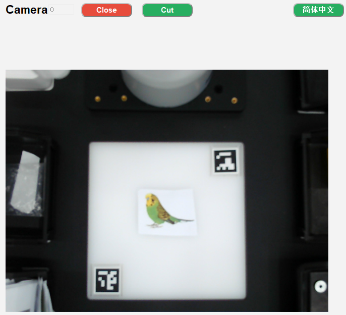
   Put in the picture that needs to be recognized, and then click the Cut button<br>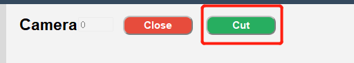
   Intercept the whiteboard part of the QR code, press Enter to confirm (repeatable interception)<br>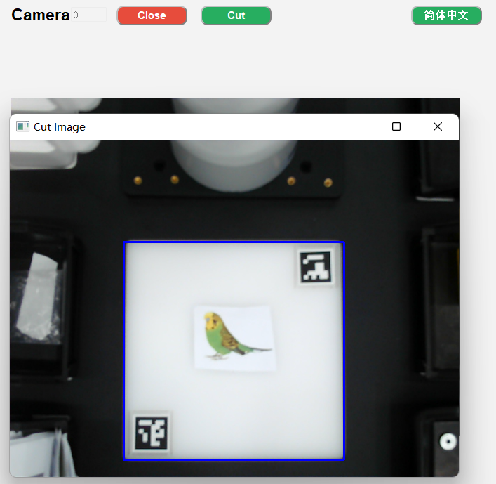
   Then identify and grab.
   
7. Add a picture for 'Keypoints' <br>
   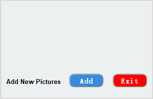
   Click the 'Add' button, the camera will open and a prompt will appear. <br>
   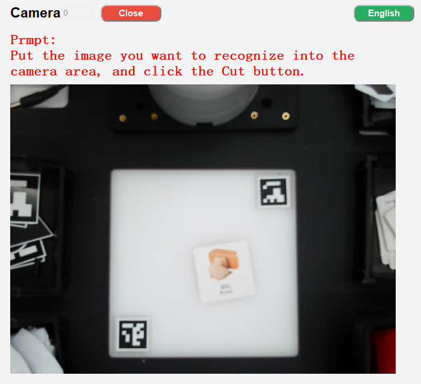
   Click the 'Cut' button, the current camera content will be intercepted, and a prompt will be given to 'press the ENTER key after the content needs to be saved'<br>

   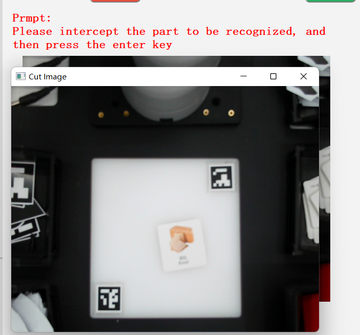
   Frame the content to be saved and press the ENTER key to start selecting the saved area, corresponding to BinA, BinB, BinC, BinD 4 storage boxes.<br>

   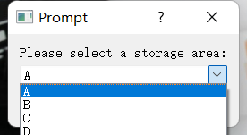
   The intercepted content will be displayed here<br>
   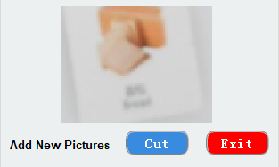

   You can enter the following path to view the saved pictures<br>
   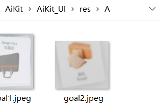

8. Click the 'Exit' button to exit adding pictures. Note: If you start capturing, please exit after capturing. You can choose not to save the captured pictures.<br>
   

##### **coordinate display**

1. Real-time coordinate display of the robotic arm: click the 'current coordinates' button to open<br>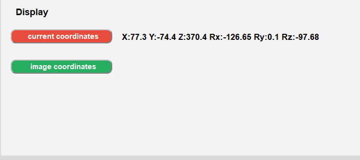

2. Recognition coordinate display: click the ''image coordinates' button to open<br>
   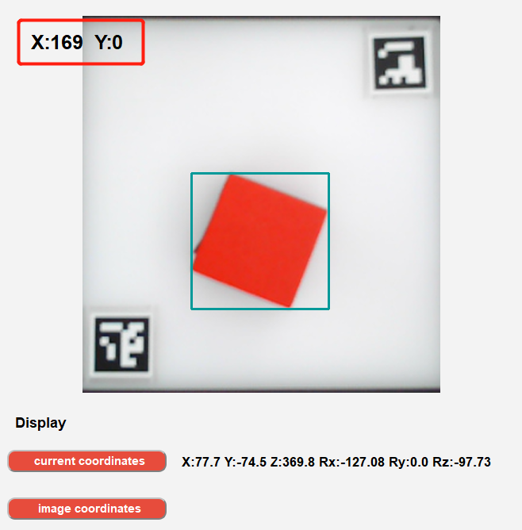

 
