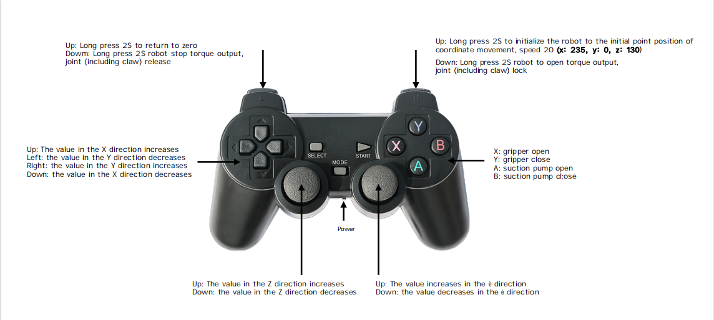
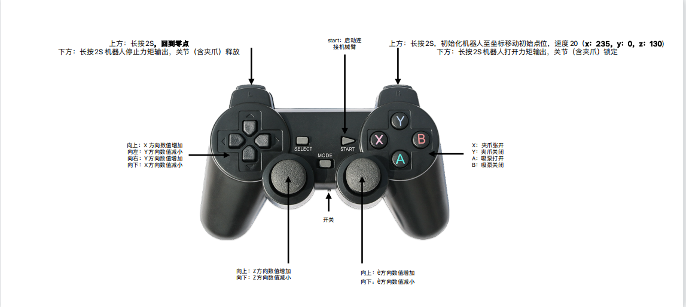

# instructions

## 1.Connecting devices

Connect the ultraArm and handle to the computer.

## 2.Install required libraries

Open the terminal, switch the path to this folder, and run the following command。

```bash
pip3 install -r requirements.txt
```

## 3.Modify port number

Edit the HandleControl_P340.py file

```python
import pygame
import time
from pymycobot import ultraArm
import threading
# Change com7 to the port number detected by your computer
mc = ultraArm("com7")
...
```

Finally. run the program.

> Note: After running the program, press and hold the **Return to Zero** button for 2 seconds, and wait for the machine to return to zero (the machine will move a lot during the process of returning to zero, and it will return to the zero position after the movement) , before other controls can be done



# 使用说明

## 1.连接设备

将ultraArm和手柄连接到电脑。

## 2.安装所需的包

打开终端，切换路径到此文件夹，运行如下指令：

```bash
pip3 install -r requirements.txt
```

## 3.修改端口号

编辑 HandleControl_P340.py 文件

```python
import pygame
import time
from pymycobot import ultraArm
import threading
# 将com7修改为你的电脑检测到的实际端口号
mc = ultraArm("com7")
...
```

最后，运行程序即可。

> 注意：在运行程序以后，要先长按 **回到零位** 按钮2s，等待机器回到零位以后（回零位过程中机器会大幅度运动，运动结束就回到了零位位置），才可以做其他控制


